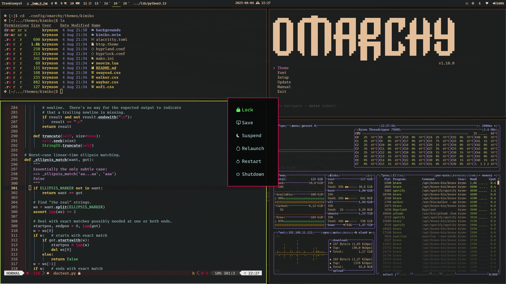

An elegant ancient newspaper bursts into a night of neon greens and purples,
when expression demands. A theme for [Omarchy](https://omarchy.org) based on my 2011 vim colorscheme



## Status

Most things should work by now.  
The nvim theme currently is an almost direct adaptation of the ancient colorscheme.

## Installation

```
omarchy-theme-install https://github.com/krymzonn/omarchy-kimiko-theme
```

The theme works with the standard Omarchy fonts, though it is
designed with Go Mono [1] in mind. Go Mono is available in Arch Extra [2]

```
yay -S ttf-go-nerd
```

[1] https://go.dev/blog/go-fonts
[2] https://archlinux.org/packages/extra/any/ttf-go-nerd/  


Let me know what you think, suggestions very welcome :)

