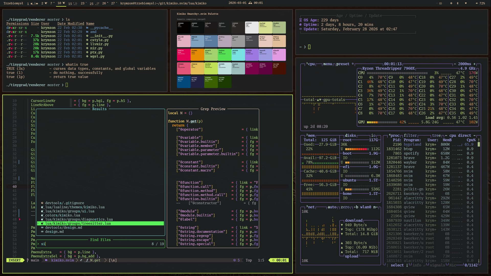

# Omarchy Kimiko Theme

XIX century newspaper bursts into a night of neon greens and purples,
when expression demands.  
A theme for [Omarchy](https://omarchy.org) based on my 2011 vim colorscheme




## What

Now updated for Omarchy 3.4: colors.toml based, with overrides

* custom nvim colorscheme
  * strings that are violet, not green
  * 36 distinct colours and shades, mostly of medium contrast
  * optimised and tested for practicality
  * honed through 15 years of primary use
    * though highly opinionated
* waybar colours - calmly informative
* mako colours - for calm, unitrusive notifications
* walker colours - saturated immediacy
* btop theme - meaningful colours, without being too distracting
* hyprlock theme - black with neon lines
  * looks particularly good on OLED
* 16 terminal colours not far off their canon names
  * improving compatibility with a wide range of TUIs
* original backgrounds
  * primary at 6K resolution

## Installation

```
omarchy-theme-install https://github.com/krymzonn/omarchy-kimiko-theme
```

## Origin

As of March 2026, this has been single-author work, including the wallpapers.
I took and edited the photos, I wrote the vim theme over 15 years.
It was for my selfish practical and aesthetic desires - while the repo
has long been public, I didn't really expect anyone else to use it.

As Omarchy was launching, it was time for me to return to contributing
to the wonderful Gift Exchange. And I found that despite many great
themes emerging, I still needed my old vim colours.

So, I've made this omarchy + nvim edition to share,
hopefully some of you may find it useful.

I do welcome comments, help, and contributions

## Optional font

The current theme files do not rely on it at all,
though the theme looks well with the official Go Lang font,
Go Mono [1] - for that old typeface, almost Baskerville-like
look.

To install the Nerd variant from Arch Extra[2]:

```
yay -S ttf-go-nerd
```

[1] <https://go.dev/blog/go-fonts>  
[2] <https://archlinux.org/packages/extra/any/ttf-go-nerd/>  

