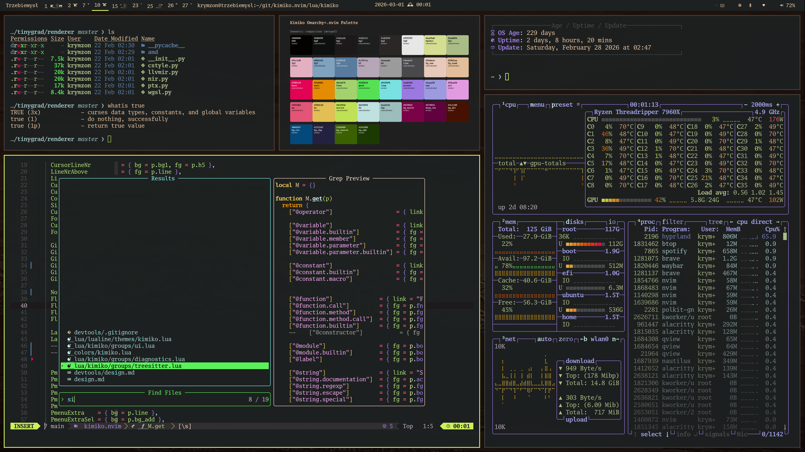

# Omarchy Kimiko Theme

XIX century newspaper bursts into a night of neon greens and purples,
when expression demands.  
A theme for [Omarchy](https://omarchy.org) 4 (Quattro), based on my 2011
vim colorscheme.




## What

`colors.toml` plus `shell.toml`. Palette names in comments are from
[kimiko.nvim](https://github.com/krymzonn/kimiko.nvim).

* custom nvim colorscheme (`krymzonn/kimiko.nvim`)
  * strings that are violet, not green
  * 36 distinct colours and shades, mostly of medium contrast
  * honed through 15 years of primary use
    * though highly opinionated
* Helix theme (same violet strings; kept on `omarchy theme install`)
* bar, notifications, launcher, lock, and bar flyouts
* btop — meaningful colours, without being too distracting
* 16 terminal colours not far off their canon names
  * caret is cypher (`#d1f85d`)
* original backgrounds
  * primary at 6K resolution


## Installation

Once `4.0` is merged to `master`:

```
omarchy theme install https://github.com/krymzonn/omarchy-kimiko-theme
```

Until then, clone the `4.0` branch into `~/.config/omarchy/themes/` (a
directory with `.git` is treated as an install: lua is dropped).

`omarchy theme install` does not apply `neovim.lua`. For the full nvim
theme, add `krymzonn/kimiko.nvim` in LazyVim, or keep a copy of this
theme **without** a `.git` directory (or a symlink to the working tree)
so Omarchy will load `neovim.lua`.


## Origin

As of March 2026, this has been single-author work, including the wallpapers.
I took and edited the photos, I wrote the vim theme over 15 years.
It was for my selfish practical and aesthetic desires - while the repo
has long been public, I didn't really expect anyone else to use it.

As Omarchy was launching, the time came for me to return to contributing
to the wonderful Gift Exchange. And I found that despite many great
themes emerging, I still needed my old vim colours.

So, I've made this omarchy + nvim edition to share,
hopefully some of you may find it useful.

Comments, help, and contributions are very welcome


## Optional font

The current theme files do not rely on it at all,
though the theme looks well with the official Go Lang font,
Go Mono [1] - for that old typeface, almost Baskerville-like
look.

To install the Nerd variant from Arch Extra[2]:

```
omarchy pkg add ttf-go-nerd
```

[1] <https://go.dev/blog/go-fonts>  
[2] <https://archlinux.org/packages/extra/any/ttf-go-nerd/>  
